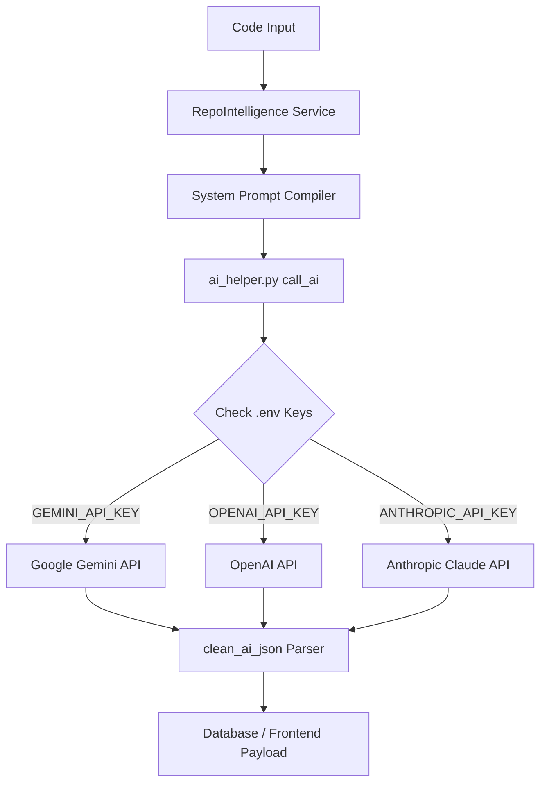
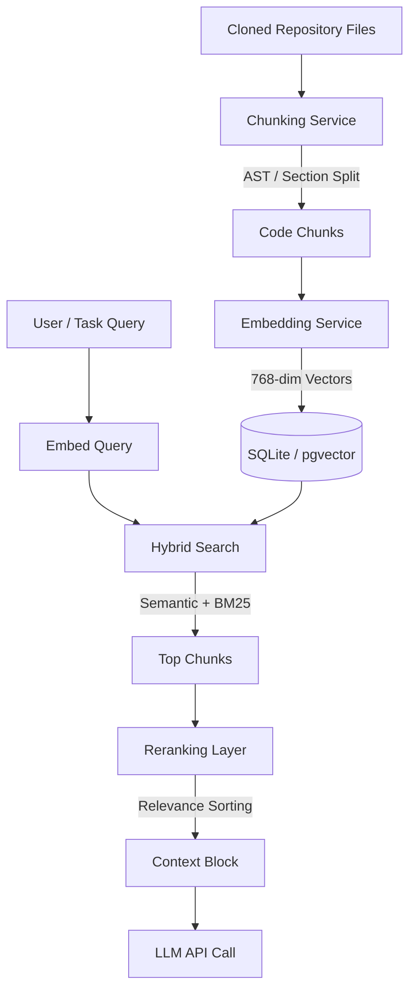
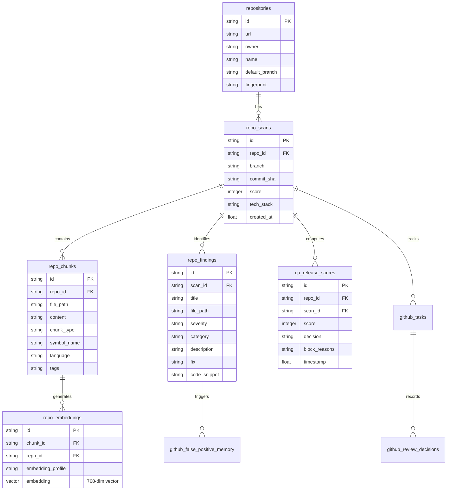
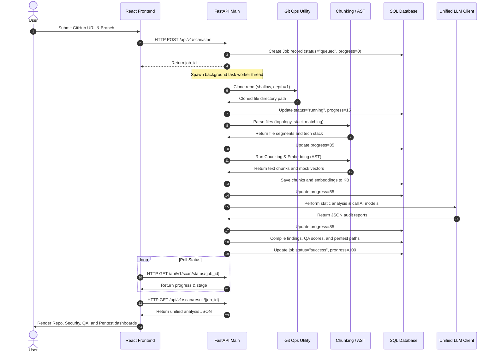
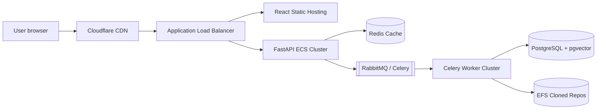
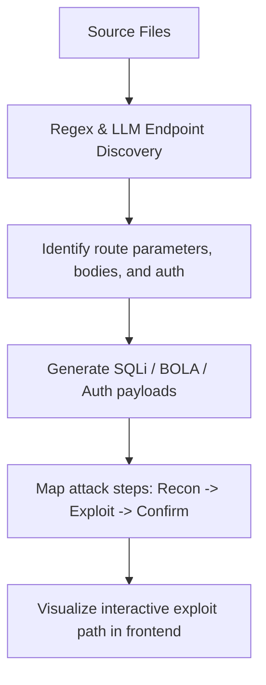
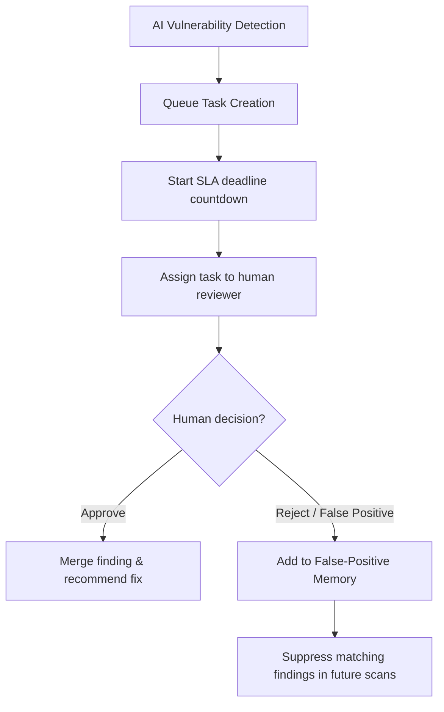
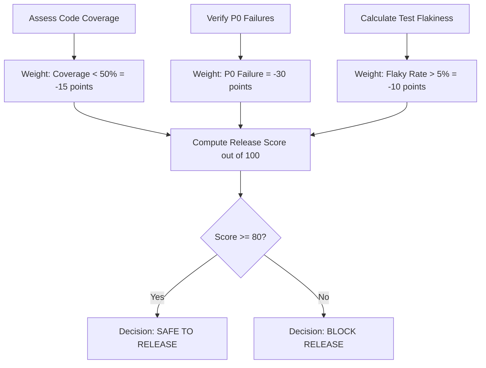

# Enterprise Technical Documentation: Autopsy AI

This document provides a comprehensive, production-grade reverse engineering analysis and architecture reference of **Autopsy AI**, an automated AI-powered DevSecOps code auditing, QA automation, and penetration testing emulation platform.

---

## 1. Executive Summary

### Project Name
*   **Autopsy AI**

### Project Purpose
Autopsy AI is designed to act as a "Senior Developer and AppSec Architect in a Box." It runs automated reviews on software repositories to evaluate architectural design patterns, detect technical debt, identify code quality regressions, audit security vulnerabilities, simulate automated QA test runs, and emulate penetration testing attacks.

### Problem Statement
In modern CI/CD lifecycles, code review and security auditing are bottlenecked by human constraints:
1.  **AppSec Knowledge Gaps**: Standard linting tools cannot understand logical flaws (e.g., BOLA anomalies, state mutations, or business logic bypasses).
2.  **QA Flakiness**: High test suite instability and low coverage remain major release blockers.
3.  **DAST Costs**: Full dynamic penetration testing is expensive, slow, and rarely integrated directly into early staging environments.
4.  **HITL Bottlenecks**: AI recommendations can produce false positives that fatigue developers if human feedback loop governance is missing.

### Target Users
*   **Tech Leads & Solutions Architects**: Seeking high-level dependency charts, circular dependency detections, and structural maintainability scores.
*   **AppSec & Security Engineers**: Requiring OWASP Top 10 compliance audits, exposed secret validation, and penetration testing emulation reports.
*   **QA & Release Engineers**: Monitoring pipeline build stability, test failures, and code coverage.
*   **Software Engineers**: Needing immediate, contextual refactoring recommendations and runnable test suite generation.

### Key Features
1.  **Static & Semantic Code Review**: Automated SonarQube-style quality assessments and cognitive complexity metrics.
2.  **Dependency & CVE Auditing**: Real-time vulnerability lookup (via OSV.dev) and outdated package checks (npm & PyPI registries).
3.  **Automated QA & Flake Analyzer**: Simulates test environments, tracks flaky UI components, and computes Release Confidence Scores.
4.  **Pentesting Emulation Engine**: Runs emulated reconnaissance, JWT/SQLi payload injections, and constructs visual exploit paths.
5.  **Human-in-the-Loop (HITL) Queue**: Governance dashboard with SLA deadlines, task routing, and false-positive learning.
6.  **Multi-Format Export**: Generates ReportLab executive PDFs and standalone HTML reports with javascript radar charts.

### Business Value
*   **Reduction in Security Incidents**: Catches credential exposures and injection vectors prior to merging.
*   **Improved Delivery Velocity**: Auto-generates test files and structural documentation to decrease manual review times.
*   **Lower Pentesting Costs**: Emulates basic DAST vectors for continuous staging validation.
*   **High Developer Adoption**: Learns from engineer feedback to systematically suppress false positives.

### High-Level System Overview
The system consists of an asynchronous **FastAPI** backend that manages local repository checkouts, performs code chunking/AST parsing, indexes vector embeddings, and coordinates with LLM providers (Gemini, OpenAI, or Claude). The front-end is a React-based single-page application built on Vite and Tailwind CSS.

---

## 2. Complete Technology Stack Analysis

### Frontend
*   **Core Framework**: React (v18+) with Vite build tool.
*   **Routing**: React Router DOM (`Routes`, `Route`, `useNavigate`, `useLocation`) managing view transitions.
*   **UI Components & Styling**: Tailwind CSS, utilizing custom configurations inside `index.css`. Includes glassmorphic dark-mode panels, progress loaders, and dashboard grid layouts.
*   **Icons**: Lucide React.
*   **Animations**: Framer Motion (`motion`, `AnimatePresence`) managing page entrance, tab switching, and card hover effects.
*   **Visualizations**: Custom HTML5 Canvas-based Radar Charts (generated dynamically on the HTML export pages).

### Backend
*   **Core Framework**: FastAPI, utilizing Uvicorn as the ASGI web server.
*   **Async Networking**: HTTPX (`httpx.AsyncClient`) for non-blocking outbound requests.
*   **Task Scheduling**: In-memory background tasks (`BackgroundTasks` from FastAPI) and SQL-based job scheduling stored in SQLite.
*   **PDF Generation**: ReportLab (`SimpleDocTemplate`, `Paragraph`, `Table`, `Spacer`) compiling vector PDFs.
*   **Database ORM**: SQLAlchemy (`declarative_base`, `sessionmaker`) managing SQL modeling.
*   **Databases**:
    *   **SQL-Based Job State**: `autopsy_jobs.db` storing background job states and pipeline schedules.
    *   **Knowledge Base**: `intelligence_v2.db` (SQLite) for local, single-file vector storage, with dynamic migration support for **PostgreSQL** combined with **pgvector** (`CREATE EXTENSION IF NOT EXISTS vector`).
*   **AI Provider APIs**:
    *   **Google Gemini API**: Target endpoint `https://generativelanguage.googleapis.com/v1beta/models/...:generateContent` using `systemInstruction`.
    *   **OpenAI API**: Target endpoint `https://api.openai.com/v1/chat/completions`.
    *   **Anthropic Claude API**: Target endpoint `https://api.anthropic.com/v1/messages`.

---

## 3. AI Architecture Deep Analysis

The AI component is abstractly unified in `backend/ai_helper.py` through a multi-provider wrapper:



### 1. Unified Multi-Provider Client (`backend/ai_helper.py`)
The utility detects configured API keys inside the backend `.env` file sequentially:
1.  **Google Gemini** (Default model: `gemini-1.5-flash`): Accesses Google Generative Language endpoints.
2.  **OpenAI** (Default model: `gpt-4o`): Uses standardized headers and completions schemas.
3.  **Anthropic Claude** (Default model: `claude-3-haiku-20240307`): Uses Anthropic-specific API headers (`x-api-key`, `anthropic-version`) and standard messages structure.

### 2. Prompt Construction & System instructions
Prompts are designed for zero-shot JSON extraction, passing strict constraints inside system instructions to prevent LLM chit-chat:
*   **Code Quality (`reviewer.py`)**: Asks the LLM to rate code on a scale of 0-100 and identify code smells, mapping outputs directly to SonarQube quality formats.
*   **QA Test Generation (`tester.py`)**: Directs the LLM to follow the **Arrange-Act-Assert (AAA)** testing pattern and output runnable test code for Jest, Pytest, JUnit, or Mocha.
*   **OWASP Security Audit (`bug_hunter.py`)**: Restricts outputs to a structured JSON mapping of CVSS scores, CWE IDs, and remediation codes.
*   **Branch Comparison (`branch_comparator.py`)**: Prompts the LLM with Git diff contents and commit logs to verify if a merge request introduces regressions.
*   **Outdated/Vulnerable Dependencies (`dependency_scanner.py`)**: Asks for upgrade priorities, conflict alerts, and semantic versioning warnings.
*   **DAST Scanner (`dast_simulator.py`)**: Analyzes discovered endpoints and attack payloads to evaluate input sanitization requirements.

### 3. Temperature & Parameter Strategies
*   **System Defaults**: Fallbacks are set to low temperature settings (typically near `0.0` or `0.1` implicitly or via default provider states) to prioritize exact JSON schema formatting over creative generation.
*   **Response Cleaning & Robust Parsing**: The helper utility `utils.parsers.clean_ai_json()` is utilized across all AI modules. It strips markdown JSON code fences (e.g. ` ```json ` and ` ``` `) via regular expressions (`re.sub(r"```(?:json)?\s*", "", raw)`) and calls `json.loads()` to convert findings into Python dictionaries.

---

## 4. Agent Analysis

While Autopsy AI does not import heavy multi-agent orchestrator frameworks (such as CrewAI, LangGraph, or AutoGen), it implements **Autonomous Service Agents** using specialized design patterns:

### System Agents
1.  **Orchestrator Agent (`RepoIntelligence` in `services/analyzer.py`)**: The primary coordinator. Clones the repository, initiates the directory topology mapping, parses files into AST nodes, executes the embeddings pipeline, builds the Knowledge Base, and calls the secondary agents to generate final security/QA metrics.
2.  **Pentesting Agent (`PentestEngine` in `core/pentest_engine.py`)**: Simulates a penetration tester. It reviews source structures for endpoints, flags missing authorization logic, parses parameters, maps potential attack graphs, and outlines a visual step-by-step exploit proof-of-concept.
3.  **QA Automation Agent (`QAEngine` in `core/qa_engine.py`)**: Emulates an SDET (Software Development Engineer in Test). It crawls routes and component structures, simulates pipeline test execution logs, logs flaky UI test paths, and calculates a pipeline Release Confidence Score.
4.  **Remediation Agent (`SmartFindingsEngine` in `services/smart_findings_engine.py`)**: Takes raw vulnerabilities, runs priority classification based on evidence, and maps issues to standard fix templates.
5.  **Governance Agent (`GitHubHITLService` in `services/github_hitl_service.py`)**: Manages the Human-in-the-Loop queue. It tracks deadlines (SLAs), logs audit trails, and records false-positive feedback loops.

### memory & Coordination
*   **Local State Memory**: The agents coordinate their state by reading and writing to the Knowledge Base tables inside `intelligence_v2.db`.
*   **False-Positive Suppression**: If a human reviewer rejects an AI-flagged issue via the HITL endpoint `/api/v1/github/governance/review`, the Governance Agent saves the item to the `GithubFalsePositive` database table. During subsequent runs, the Orchestrator queries this table and suppresses matching security findings, creating a continuous feedback loop.

---

## 5. Module-by-Module Documentation

### Backend Modules

#### 1. Entry Point: `backend/main.py`
*   **Purpose**: Bootstraps the FastAPI application, exposes HTTP routes, handles CORS configurations, initializes database engines, and runs background scan threads.
*   **APIs Exposed**:
    *   `/api/v1/scan/start` (POST): Starts a background repository clone and analysis.
    *   `/api/v1/scan/status/{job_id}` (GET): Returns the current stage and progress percentage of a scan.
    *   `/api/v1/scan/result/{job_id}` (GET): Compiles and returns the unified analysis payload.
    *   `/api/v1/security/export-pdf` (POST): Returns a downloadable ReportLab PDF.
    *   `/api/v1/github/governance/...` (GET/POST): Manages HITL tasks, queue status, and review approvals/rejections.
*   **Internal Classes**:
    *   `ScanRequest`, `UploadRequest`, `HITLDecisionRequest`, `ScheduleCreateRequest` (Pydantic schemas).
*   **Database Called**: Reads and writes background jobs and schedule items inside `autopsy_jobs.db`. Reads findings and HITL metrics from `intelligence_v2.db`.

#### 2. Scan Coordinator: `backend/services/analyzer.py`
*   **Purpose**: Houses `RepoIntelligence`, the master scanning logic. Coordinates Git operations, file exclusion rules, language matching, AST parsing, QA runs, and pentest simulations.
*   **Internal Methods**:
    *   `run_full_analysis(repo_url, branch, job_id, db_session)`: Runs the scan in a separate background thread, reporting progress percentages back to the job database.
    *   `_extract_file_topology(...)`: Walks the cloned folder tree, skipping excluded paths (e.g. `.git`, `node_modules`, `venv`) to load file contents.
    *   `_detect_tech_stack(...)`: Scans dependency manifests to identify languages, frameworks, and deployment options.
*   **External Systems Called**: Git CLI (via `git clone`), LLM endpoints (via `call_ai`), and registry APIs.

#### 3. Database Schema Declarations: `backend/services/kb_service.py`
*   **Purpose**: Manages SQLAlchemy model schemas and provides fallback SQLite migrations for environments lacking PostgreSQL pgvector setups.
*   **Internal Database Structures**:
    *   Declarative schemas for: `Repository`, `RepoScan`, `RepoChunk`, `RepoEmbedding` (featuring a custom `Vector(768)` type for PostgreSQL pgvector configurations), `RepoFinding`, `RepoGraphNode`, `RepoGraphEdge`, `QAFlakyMemory`, `QAHistoricalFailures`, `QAReleaseScores`, `GithubFalsePositive`.

#### 4. Remediation Advisor: `backend/services/smart_findings_engine.py`
*   **Purpose**: Prioritizes raw security findings, provides educational documentation hooks, and maps remediation suggestions.
*   **Internal Methods**:
    *   `prioritize_and_enrich(findings)`: Classifies severities and adds standard fixes.
    *   `get_remediation_template(cwe_id)`: Returns custom fix templates (e.g. for SQL injection, command execution, or path traversal).

#### 5. HITL Governance: `backend/services/github_hitl_service.py`
*   **Purpose**: Manages human reviews, logs compliance details, and tracks SLA indicators.
*   **Internal Methods**:
    *   `assign_task(task_id, reviewer_id)`, `submit_decision(task_id, decision, notes)`, `is_false_positive(repo_id, category, file_path)`.

#### 6. Penetration Engine: `backend/core/pentest_engine.py`
*   **Purpose**: Simulates dynamic security scans, identifies API routes, and constructs attack graphs.
*   **Internal Methods**:
    *   `generate_pentest_intelligence(...)`: Scans files for authentication logic, BOLA risks, and SQL injection indicators, returning attack steps.

#### 7. QA Simulator: `backend/core/qa_engine.py`
*   **Purpose**: Maps routes and frontend views, simulates unit/integration test results, tracks flaky indicators, and calculates release confidence scores.
*   **Internal Methods**:
    *   `generate_qa_intelligence(...)`: Orchestrates test suite simulations and logs execution stats in the database.

#### 8. Parsing and RAG Helpers: `backend/core/*`
*   **`chunking_service.py`**: Separates Python code via `ast.parse` into functional/class chunks, JS/TS into logical code blocks, and Markdown into header sections.
*   **`embedding_service.py`**: Generates vector representations of code chunks (mocked to a 768-dimension vector of `0.01` values).
*   **`fingerprint_engine.py`**: Generates SHA256 hashes of repository stacks to prevent duplicate scanning.
*   **`historical_memory.py`**: Retrieves past review results to construct context strings for prompts.
*   **`hybrid_search.py`**: Merges semantic and keyword matches (mocked locally).
*   **`repository_graph.py`**: Represents files, databases, and routes as nodes and edges.
*   **`rerank_service.py`**: Re-orders matches to prioritize relevant code blocks (mocked to return top N items).
*   **`retrieval_service.py`**: Integrates search and ranking algorithms to compile RAG contexts.

#### 9. Standalone Routers: `backend/routes/*`
*   *Note: These routers contain modular, self-contained endpoints. They are not active in `main.py` because `main.py` uses its own background scan routines.*
*   **`reviewer.py`**: Analyzes code quality metrics using LLMs.
*   **`tester.py`**: Generates runnable unit tests (e.g. using `pytest`).
*   **`bug_hunter.py`**: Combines regex-based credential checks with LLM security audits.
*   **`dependency_scanner.py`**: Interfaces with `api.osv.dev/v1/query` to identify dependency CVEs.
*   **`package_checker.py`**: Checks PyPI and npm registries for outdated packages.
*   **`branch_comparator.py`**: Diff branch files and runs regression audits.
*   **`webhook.py`**: Handles GitHub webhook payloads (`push`, `pull_request`).
*   **`pr_integration.py`**: Posts markdown summary comments on GitHub PRs.
*   **`report_export.py`**: Compiles analysis metrics into downloadable HTML files.

### Frontend Modules

#### 1. App Router: `frontend/src/App.jsx`
*   **Purpose**: Renders the main user interface layout, handles file upload forms and GitHub repository URL submissions, runs the status polling loop (`/api/v1/scan/status/...`), and forwards results to the dashboards.

#### 2. Repos Dashboard: `frontend/src/components/RepoDashboard.jsx`
*   **Purpose**: Displays code metrics, project complexity indices, circular dependency graphs, and code duplication listings.

#### 3. Security Dashboard: `frontend/src/components/CodeSecurityDashboard.jsx`
*   **Purpose**: Displays security compliance ratings, dependency CVE alerts, hardcoded credentials, and remediations.

#### 4. QA Dashboard: `frontend/src/components/QaAutomationDashboard.jsx`
*   **Purpose**: Renders pipeline test suite logs, flaky UI test components, and Release Confidence Scores.

#### 5. Pentest Dashboard: `frontend/src/components/PentestDashboard.jsx`
*   **Purpose**: Renders dynamic attack chains, API vulnerability findings, and step-by-step exploit instructions.

---

## 6. RAG (Retrieval-Augmented Generation) Analysis

Autopsy AI implements a code-specific RAG pipeline designed to inject relevant codebase contexts into LLM prompts:



### 1. Data Sources & Chunking Strategy
*   **Sources**: Source files crawled from the local clone directory.
*   **Language-Specific AST Chunking (`ChunkingService` in `core/chunking_service.py`)**:
    *   **Python (`.py`)**: Uses Python's built-in `ast` module. Parses the source into abstract trees, identifies `FunctionDef`, `AsyncFunctionDef`, and `ClassDef` nodes, and chunks them using `ast.get_source_segment()`.
    *   **JavaScript & TypeScript (`.js`, `.ts`, `.jsx`, `.tsx`)**: Falls back to keyword-based extraction, separating modules and React components based on structural constructs (`function`, `class`, `const`).
    *   **Markdown (`.md`, `.txt`)**: Splitted into chunks based on headers (using the separator `\n## `).
    *   **Configurations (`.json`, `.yaml`, `.toml`, `Dockerfile`)**: Parsed as single structural configuration files.

### 2. Embedding Model
*   **Implementation (`EmbeddingService` in `core/embedding_service.py`)**:
    *   For local executions, it generates a mock 768-dimensional vector populated with `0.01` values.
    *   It contains configuration settings to plug in models like OpenAI's `text-embedding-3-large` or local models (such as `BAAI/bge-large-en-v1.5`).

### 3. Vector Database
*   **Dual Engine Support (`kb_service.py`)**:
    *   **PostgreSQL**: Maps chunks to a `Vector(768)` type database column using `pgvector`.
    *   **SQLite**: Graces down to standard SQLite schemas if Postgres configurations are missing, saving raw chunk texts.

### 4. Retrieval Workflow & Reranking
*   **Contextual Search (`retrieval_service.py`)**:
    *   Filters chunks based on task types:
        *   `architecture analysis` filters for `['architecture', 'module']` tags.
        *   `testing posture` filters for `['test', 'coverage']` tags.
        *   `security` filters for `['auth', 'security', 'database']` tags.
    *   **Hybrid search (`hybrid_search.py`)**: Designed to merge semantic vector matches with keyword BM25 searches.
    *   **Reranking (`rerank_service.py`)**: Sorts search results to prioritize relevant contexts (mocked to return the top N items).

### 5. Context Assembly & Citations
*   Matches are concatenated into a single code block and injected into the LLM prompt. Each finding links back to its originating file path and lines to serve as source evidence.

---

## 7. Knowledge Base Analysis

The Knowledge Base is the central repository intelligence store. It maintains structural and relational states across repository scans:

### 1. KB Creation & Indexing
1.  **Clone & Fingerprint**: Clones the repo, identifies the tech stack, and computes a SHA256 signature to verify if the code structure has changed.
2.  **Topological Parsing**: Walks through files, extracts metadata, and segments them using `ChunkingService`.
3.  **Graph Generation**: Indexes import dependencies and database links to populate node-edge database tables (`RepoGraphNode`, `RepoGraphEdge`).
4.  **Vector Persistence**: Generates and saves vector embeddings to database tables.

### 2. Relational vs. Vector Schema Tables
*   **SQLite Single-File Store**: Used for local developer setups.
*   **PostgreSQL with pgvector**: Extends SQLite tables to support semantic search.

### 3. Key Database Tables
*   `repositories`: Tracks repository metadata and structure fingerprints.
*   `repo_scans`: Stores scan IDs, branch names, commit hashes, maintainability grades, and KPI records.
*   `repo_chunks`: Maps chunk texts to their source file paths, line ranges, and category tags.
*   `repo_embeddings`: Stores vector embeddings, linking them back to chunks.
*   `repo_findings`: Stores vulnerability details, severities, code contexts, and remediation templates.
*   `repo_graph_nodes` & `repo_graph_edges`: Represents code relationships for dependency charts.

---

## 8. API Documentation

This section documents the primary API endpoints exposed by the backend:

### 1. `/api/v1/scan/start` (POST)
*   **Purpose**: Starts an asynchronous repository clone and audit.
*   **Request Headers**: `Content-Type: application/json`
*   **Request Body**:
    ```json
    {
      "url": "https://github.com/owner/repo",
      "branch": "main"
    }
    ```
*   **Response Format (200 OK)**:
    ```json
    {
      "job_id": "8a3b8d62c9e74d4ebfcf387ef248d1de",
      "status": "queued"
    }
    ```
*   **Error Codes**:
    *   `400 Bad Request`: Missing or invalid GitHub repository URL.

### 2. `/api/v1/scan/status/{job_id}` (GET)
*   **Purpose**: Returns the progress percentage and current stage of a background scan.
*   **Response Format (200 OK)**:
    ```json
    {
      "job_id": "8a3b8d62c9e74d4ebfcf387ef248d1de",
      "status": "running",
      "progress": 45,
      "stage": "Extracting code structures and dependencies",
      "error": null
    }
    ```
*   **Error Codes**:
    *   `404 Not Found`: Job ID does not exist or has expired.

### 3. `/api/v1/scan/result/{job_id}` (GET)
*   **Purpose**: Compiles and returns the final scan results.
*   **Response Format (200 OK)**:
    ```json
    {
      "repository_overview": { "name": "...", "url": "..." },
      "kpis": { "lines_of_code": 12040, "files_count": 84 },
      "scores": { "overall": 88, "security": 92, "qa": 85, "architecture": 82 },
      "security_platform": {
        "sast_findings": [
          { "id": "...", "title": "SQL Injection Risk", "file": "db.py", "line": 42, "severity": "critical", "fix": "..." }
        ],
        "secrets": []
      },
      "qa_platform": {
        "overview": { "total_tests": 124, "passed_tests": 120, "failed_tests": 2, "flaky_tests": 2, "coverage": "78%" }
      },
      "pentest_platform": {
        "endpoints": [],
        "scenarios": []
      }
    }
    ```
*   **Error Codes**:
    *   `400 Bad Request`: Job has not finished executing.
    *   `404 Not Found`: Job results not found.

### 4. `/api/v1/github/governance/queue` (GET)
*   **Purpose**: Returns the current task queue for human review.
*   **Response Format (200 OK)**:
    ```json
    [
      {
        "task_id": "9b12a84c",
        "finding_title": "Hardcoded JWT Secret",
        "file_path": "auth.js",
        "assigned_to": "AppSec Team",
        "sla_deadline": "2026-06-10T12:00:00Z"
      }
    ]
    ```

### 5. `/api/v1/github/governance/review` (POST)
*   **Purpose**: Submits a human decision (approve, reject, or mark as false positive).
*   **Request Body**:
    ```json
    {
      "task_id": "9b12a84c",
      "decision": "REJECTED",
      "notes": "Legitimate mock secret in test files, mark as false positive."
    }
    ```
*   **Response Format (200 OK)**:
    ```json
    {
      "status": "success",
      "suppressed": true
    }
    ```

---

## 9. Database Documentation

The system operates two database configurations: `autopsy_jobs.db` (job state details) and `intelligence_v2.db` (the repository knowledge base).

### Entity Relationship Diagram (Knowledge Base)



### Constraints & Indices
1.  **Primary Keys**: UUID strings (`uuid.uuid4().hex`) generated on the application side to ensure partition safety.
2.  **Foreign Keys**: `repo_id` links chunks, scans, and embeddings. `scan_id` links findings and release scores.
3.  **Indices**:
    *   Index on `repo_chunks(repo_id)` and `repo_chunks(file_path)` to speed up file topology lookups.
    *   Index on `repo_embeddings(chunk_id)` for RAG lookups.

---

## 10. Security Architecture

### 1. Threat Model & Risk Profile
*   **Untrusted Code Ingress**: Cloning third-party repositories could expose the system to malicious dependencies or syntax attacks.
*   **Secret Exposure**: Scanning repositories with hardcoded API keys could leak credentials if databases are poorly protected.
*   **LLM Data Leakage**: Sending proprietary codebase segments to external LLM APIs (Gemini, OpenAI, or Claude) can violate data privacy standards.

### 2. Authorization & Data Isolation
*   **Repository Isolation**: Cloned repositories are saved to separate sub-directories (configured in `git_ops.py` under the directory path `cloned_repos/{owner}__{repo}__{branch}__{tag}`).
*   **Access Control**: Endpoints verify and restrict queries using repository and job identifiers.
*   **HMAC Webhook Verification (`webhook.py`)**: Incoming GitHub webhooks verify the `X-Hub-Signature-256` header against the local `GITHUB_WEBHOOK_SECRET` environment variable using HMAC-SHA256 to ensure authenticity.

### 3. Key Storage & Secrets Management
*   **Environment Variables**: API tokens (`GEMINI_API_KEY`, `OPENAI_API_KEY`, `ANTHROPIC_API_KEY`, and `GITHUB_TOKEN`) are loaded into memory from the backend `.env` file using `python-dotenv`. They are not persisted in database fields.

### 4. Code Security Auditing (Static & DAST)
*   **Static regex Scans (`bug_hunter.py`)**: Utilizes regular expressions to detect hardcoded secrets (API keys, passwords, Stripe keys, or AWS IDs), dangerous function calls (`eval`, `exec`, `pickle.loads`, `os.system`), SQL injection f-strings, and weak cryptography algorithms (MD5, SHA1, DES).
*   **DAST Simulation (`dast_simulator.py` / `pentest_engine.py`)**: Maps endpoints and parameters to run mock injection tests (SQLi, XSS, Command Injection, BOLA) and verify input sanitization.

---

## 11. Application Workflow

This section outlines the workflow of a scan, from user submission to dashboard visualization:



---

## 12. Output Analysis

Autopsy AI supports three output formats:

### 1. JSON Payloads
*   **Format**: Structured dictionary returned by `/api/v1/scan/result/{job_id}`.
*   **Structure**:
    *   `repository_overview`: metadata about the repository.
    *   `kpis`: metrics such as lines of code, file counts, and language percentages.
    *   `scores`: overall maintainability, security, and QA scores.
    *   `architecture`: structural patterns and circular dependencies.
    *   `security_platform`: SAST vulnerabilities, exposed secrets, and dependency CVEs.
    *   `qa_platform`: simulated test logs, flaky components, and confidence scores.
    *   `pentest_platform`: API endpoints, attack scenarios, and exploit steps.

### 2. Standalone HTML Reports (`report_export.py`)
*   **Format**: Single HTML file with embedded CSS styling and javascript.
*   **Visual Assets**:
    *   **Score Ring**: Rendered based on the overall maintainability rating.
    *   **KPI Summary**: Grid displaying vulnerability counts by severity.
    *   **Score Bars**: Rendered for Code Review, Security, QA, and Architecture metrics.
    *   **Radar Chart**: Embedded HTML5 Canvas-based chart mapping category ratings.
    *   **Vulnerability List**: Color-coded security findings.

### 3. Executive PDF Reports (`pdf_generator.py`)
*   **Format**: Letter-format PDF generated via ReportLab.
*   **Structure**:
    *   **Cover Page**: Document title with a custom header.
    *   **KPI Summary Table**: Structured table summarizing security ratings.
    *   **SAST Findings**: Section detail listing file locations, severity ratings, impact assessments, and remediations.
    *   **Exposed Secrets**: Detail list highlighting credentials found and recommended secret managers.

---

## 13. Infrastructure Analysis

To deploy Autopsy AI in an enterprise environment, the following architecture is recommended:



### 1. Enterprise Deployment Options
*   **Frontend**: Hosted as a static site on cloud storage (e.g. AWS S3, Vercel, or Netlify) behind a CDN (Cloudflare).
*   **Backend REST APIs**: Containerized (using Docker) and deployed on orchestrators (such as AWS ECS Fargate or Kubernetes).
*   **Asynchronous Processing**: Instead of in-memory background threads, use Celery workers with RabbitMQ/Redis to process long-running cloning and scanning jobs.

### 2. Scalability & Storage Requirements
*   **Database**: Managed PostgreSQL instance (AWS RDS) with the `pgvector` extension enabled.
*   **Shared Storage (EFS / EBS)**: Required to host checked-out repositories during parsing. Files are deleted after scanning completes using `cleanup_clone()` to optimize storage.
*   **Caching Layer**: Redis cache used to store API token queries and repeat scans.

---

## 14. File Structure Analysis

The directory layout of the Autopsy AI codebase is organized as follows:

```text
Autopsy-ai/
│
├── backend/                       # FastAPI Backend
│   ├── core/                      # RAG and Analytics Core
│   │   ├── chunking_service.py    # AST and markdown chunk separators
│   │   ├── embedding_service.py   # Code embedding interface (mocked)
│   │   ├── fingerprint_engine.py  # Repository hashing utilities
│   │   ├── historical_memory.py   # Historical context generator
│   │   ├── hybrid_search.py       # Semantic and keyword search
│   │   ├── pentest_engine.py      # DAST simulation and exploit mapper
│   │   ├── qa_engine.py           # QA test suite and flake simulator
│   │   ├── repository_graph.py    # Node-edge dependency graphs
│   │   ├── rerank_service.py      # Cohere / cross-encoder ranker (mocked)
│   │   └── retrieval_service.py   # Vector retrieval engines
│   │
│   ├── routes/                    # Modular API Routers (legacy/standalone)
│   │   ├── bug_hunter.py          # Credential scans & OWASP audits
│   │   ├── reviewer.py            # Code quality and smell analyzer
│   │   ├── tester.py              # Pytest/Jest unit test generators
│   │   ├── documenter.py          # README.md markdown builders
│   │   ├── code_analyzer.py       # AST complexity & React/Angular hooks lint
│   │   ├── dependency_scanner.py  # OSV.dev CVE checks
│   │   ├── package_checker.py     # Registry version checkers
│   │   ├── branch_comparator.py   # Git branch diff comparison
│   │   ├── webhook.py             # GitHub webhook receivers
│   │   ├── pr_integration.py      # PR comment integrations
│   │   └── report_export.py       # Standalone HTML report compilers
│   │
│   ├── services/                  # Business Logic and Orchestrators
│   │   ├── analyzer.py            # Master scan orchestrator (RepoIntelligence)
│   │   ├── kb_service.py          # SQLAlchemy models and SQLite migrations
│   │   ├── smart_findings_engine.py# Vulnerability prioritization engine
│   │   ├── github_hitl_service.py # Human review queue governance
│   │   └── pdf_generator.py       # ReportLab PDF builders
│   │
│   ├── utils/                     # Formatting Helpers
│   │   ├── constants.py           # File exclusion and language lists
│   │   ├── git_ops.py             # Git cloning and branch lookups
│   │   └── parsers.py             # JSON cleaners and package parsers
│   │
│   ├── ai_helper.py               # Gemini / OpenAI / Claude API clients
│   └── main.py                    # Main API entry point and routes
│
├── frontend/                      # React Frontend
│   ├── src/
│   │   ├── components/            # UI Components
│   │   │   ├── RepoDashboard.jsx  # Maintainability & metrics views
│   │   │   ├── CodeSecurityDashboard.jsx # Vulnerability and secret lists
│   │   │   ├── AiCodeReviewDashboard.jsx # Code smell and refactor views
│   │   │   ├── QaAutomationDashboard.jsx # Test run and flake logs
│   │   │   ├── PentestDashboard.jsx  # Exploit graphs and recon views
│   │   │   ├── Navbar.jsx
│   │   │   └── Footer.jsx
│   │   ├── pages/
│   │   │   └── LandingPage.jsx    # Project landing dashboard
│   │   ├── App.jsx                # UI router and polling loop
│   │   ├── index.css              # Custom Tailwind styling
│   │   └── main.jsx               # React DOM bootstrapper
│   └── package.json               # Node dependencies configuration
│
└── start_windows.bat              # Service startup script
```

---

## 15. Third-Party Integrations

### 1. GitHub API & Git CLI
*   **`subprocess` Wrapper (`git_ops.py`)**: Runs Git commands in a shell environment (`git clone --depth 1 --branch {branch} {url} {dir}`) to checkout code.
*   **Outbound API Integration (`pr_integration.py`)**: Calls GitHub's REST endpoints (`POST /repos/{owner}/{repo}/issues/{pr_number}/comments`) to post analysis reports on PRs.

### 2. OSV.dev (Open Source Vulnerability Database)
*   **Vulnerability Queries (`dependency_scanner.py`)**: Sends package names, versions, and ecosystems to `https://api.osv.dev/v1/query`. It parses the returned list of CVEs, CVSS scores, and fixed versions.

### 3. Registry APIs (npm & PyPI)
*   **npm Registry (`package_checker.py`)**: Calls `https://registry.npmjs.org/{name}` to extract semver details, deprecation flags, and homepage URLs.
*   **PyPI API (`package_checker.py`)**: Calls `https://pypi.org/pypi/{name}/json` to parse package updates.

### 4. PDF Generation (ReportLab)
*   **PDF Layouts (`pdf_generator.py`)**: Generates structured security audit reports containing tables and code snippets.

---

## 16. Architecture Diagrams

This section provides visual flowcharts mapping system interactions:

### 1. Exploit Generation Flow (Pentesting Engine)



### 2. HITL Governance Loop (Review System)



### 3. QA Release Confidence Score Calculation



---

## 17. Feature Matrix

This matrix maps primary product features to their implementation modules, tools, and visual displays:

| Product Module | Feature Description | Implementation Files | Libraries / Integrations | Frontend Component |
| :--- | :--- | :--- | :--- | :--- |
| **GitHub Intelligence** | Code topology, complexity, and duplicate code. | `analyzer.py`, `code_analyzer.py`, `repository_graph.py` | `ast` (Python), Regex, hashlib | `RepoDashboard.jsx` |
| **Security Auditing** | OWASP vulnerabilities, credentials, and CVEs. | `bug_hunter.py`, `dependency_scanner.py`, `smart_findings_engine.py` | HTTPX, OSV.dev API | `CodeSecurityDashboard.jsx` |
| **AI Code Review** | Code quality score and refactoring suggest. | `reviewer.py`, `main.py` | Unified LLM Client (`ai_helper.py`) | `AiCodeReviewDashboard.jsx` |
| **QA Automation** | Pipeline runs, flaky components, and test gen. | `qa_engine.py`, `tester.py` | pytest, JUnit, Jest config templates | `QaAutomationDashboard.jsx` |
| **Pentesting** | Attack chains and API vulnerabilities. | `pentest_engine.py`, `dast_simulator.py` | Regex patterns, LLM mapping | `PentestDashboard.jsx` |
| **HITL Governance** | Task tracking, SLA metrics, and false positives. | `github_hitl_service.py`, `main.py` | SQLAlchemy tables, DB triggers | App/HITL panel |

---

## 18. Missing Components & Mock Implementations Analysis

During the reverse engineering process, several mocked routines were identified. These stubs must be replaced with production-ready implementations before enterprise deployment:

### 1. Vector Embeddings (`embedding_service.py`)
*   **Current State**: Generates a mock 768-dimensional vector populated with `0.01` values.
*   **Code Segment**:
    ```python
    async def generate_embeddings_async(self, texts: List[str], model_profile: str = "source_code") -> List[List[float]]:
        return [[0.01 for _ in range(768)] for _ in texts]
    ```
*   **Required Fix**: Implement calls to OpenAI (`text-embedding-3-large`) or run local embedding generation using SentenceTransformers.

### 2. Hybrid Search (`hybrid_search.py`)
*   **Current State**: Returns an empty list, bypassing semantic database retrieval.
*   **Required Fix**: Write PostgreSQL/pgvector search queries combining vector distance matches (`<=>`) with full-text search ranks (`ts_rank_cd`).

### 3. Reranking Layer (`rerank_service.py`)
*   **Current State**: Mocks reranking by simply slicing the top results.
*   **Required Fix**: Integrate a Cohere client or cross-encoder model to re-sort results.

### 4. Historical Scanning Memory (`historical_memory.py`)
*   **Current State**: Methods return stub values like `[]` or `"No historical context available."`
*   **Required Fix**: Implement queries fetching past findings from the `repo_findings` database tables.

### 5. Standalone Router Mounting (`main.py`)
*   **Current State**: Sub-routers under `backend/routes/` are not imported or registered via `app.include_router()` in `main.py`.
*   **Required Fix**: Add router registration lines in `main.py` to expose endpoints for PR comments, webhooks, and manual document generation.

---

## 19. Improvement Recommendations

### 1. Architecture Enhancements
*   **Worker Queues**: Transition from in-memory background threads to a distributed queue architecture (e.g. Celery with Redis/RabbitMQ) to prevent API crashes during concurrent scans.
*   **Routing Cleanups**: Mount the sub-routers defined under `backend/routes/` in `main.py` to eliminate duplicate endpoints.

### 2. Security Enhancements
*   **Containerized Scans**: Run repository clone and parsing operations inside isolated, read-only Docker containers to mitigate command injection risks.
*   **Secret Protection**: Implement a key vault integration (such as HashiCorp Vault or AWS Secrets Manager) to securely store API tokens.

### 3. Performance Optimizations
*   **True Embeddings**: Enable the pgvector search pipeline to replace mock embeddings and improve query speeds.
*   **AST Caching**: Cache repository AST graphs in a Redis cache to optimize re-scans.

### 4. Usability Enhancements
*   **Interactive Exploit Runs**: Allow users to run pentest scenarios directly from the dashboard against staging endpoints.
*   **Interactive Refactoring**: Let developers commit refactoring suggestions directly back to their GitHub branch from the UI.

---

## 20. Final System Understanding Report

Autopsy AI is a DevSecOps auditing platform that integrates static analysis, dynamic pentesting simulations, and QA automation into a unified dashboard.

```text
       +---------------------------------------------+
       |             React / Vite UI                 |
       +--------------------+------------------------+
                            |
           REST API Requests| Polling Loop
                            v
       +---------------------------------------------+
       |             FastAPI Server                  |
       +-----+--------------+------------------+-----+
             |              |                  |
   Git Ops   |    AST/RAG   |    AI Helper     |  DB ORM
   Utilities |    Engine    |    Providers     |  Schemas
             v              v                  v
       +-----+---+    +-----+----+       +-----+----+  +---------+
       | Git CLI |    | AST/RAG  |       | Gemini   |  | SQLite  |
       |  Clones |    | Chunks   |       | OpenAI   |  | Postgres|
       +---------+    +----------+       | Claude   |  +---------+
                                         +----------+
```

### Synthesis
1.  **Ingestion**: The user submits a URL in the UI. The backend clones the repository, parses files, and maps dependencies.
2.  **Analysis**: The Orchestrator runs regex scans and calls the AI Helper to invoke LLM engines. Simultaneously, the QA and Pentest engines generate simulated pipeline and exploit logs.
3.  **Governance**: The results are saved to the database. Security issues are routed to a human review queue, which filters out false positives based on previous feedback.
4.  **Reporting**: Visual graphs, ReportLab PDFs, and HTML exports are compiled and rendered to the user.

Replacing the mocked embedding and search services will elevate Autopsy AI to a production-grade enterprise auditing solution.
